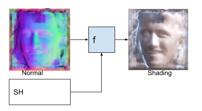
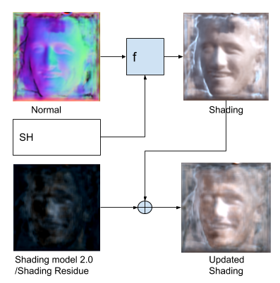

# Illumination-Estimation-With-Residue-Networks
This works extends [SfSNet](https://github.com/bhushan23/SfSNet-PyTorch)

## Problem Statement
SfSNet generated shading is generated using Normal and Spherical Harmonics which does not
captures the full illumination details. Due to geometric imperfection and spherical harmonics
inaccuracy, generated shading is not near to perfect. Later, shading is used along with albedo to
reconstruct the image. Following image shows traditional shading model which is based on Normal and
Spherical Harmonics. 

## Solution
We propose to introduce new shading layer to capture more flexible and comprehensive illumination
effect that is not modelled by 27 dimensional spherical harmonics like SfSNet. We capture this
representation directly using image features and residual block being used in SfSNet for albedo and
normal. Later, we add this representation into SfSNet based generated shading. This shading layer is
residue of illumination missed by SfSNet. Figure 6 shows new illumination model we are proposing

Measure issue with reconstructin faces using Shading, Albedo, Normal and Spherical Harmonics is little variations in normal and spherical harmonics causing different illumination.

Estimating Normal and Spherical Harmonics with slight error causes different illumination and expected.
In order to overcome this problem, we would like to using correcting networks

### Shading Correcting Network
1_Shading_Correcting works on priciple built on top of tradition shading generation using normal and spherical harmonics
We generate Shading and then rectify it using latent ligthing generated from Normal, Albedo and Image features.

### Latent Shading Generation
2_Latent_Shading_Gen works on principle to avoid generation of Spherical Harmonics and instead generate shading directly using Normal, Albedo and Image features. And then use this latent lighting along with Normal to generate shading
